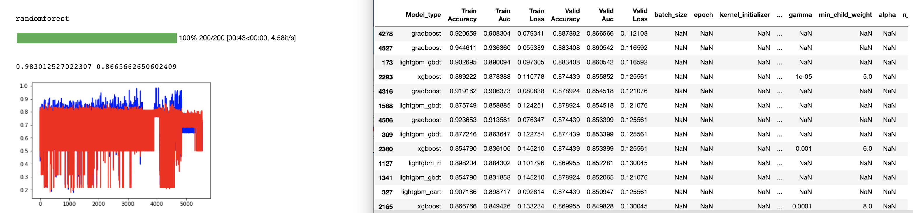
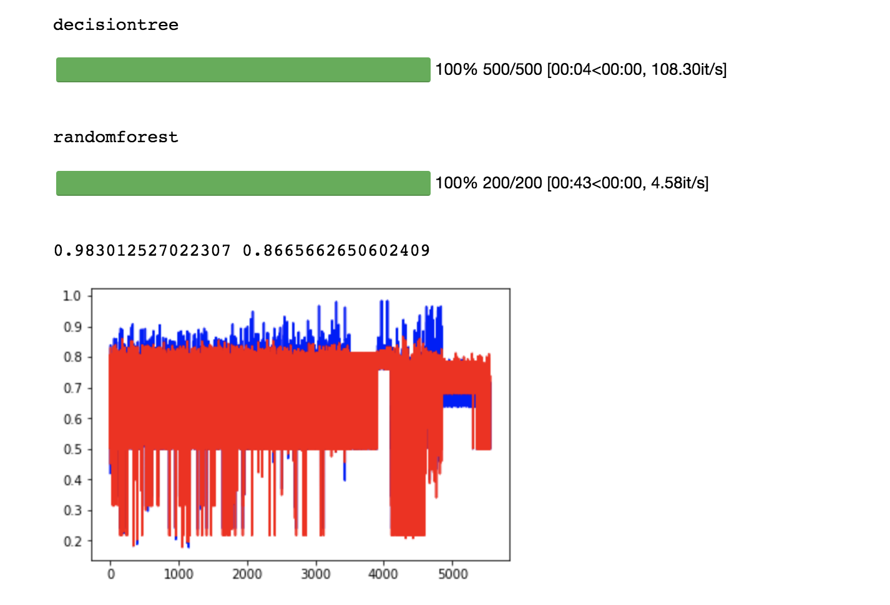

# Modgen - Automatic Model Generator
## Overview of Modgen
This program was created for rapid feature engineering without the need to optimize each model.  Modgen is designed to develop a quick overview of how your updated features will react to each model.  You can use one specific algorithm or a wide variety (depending on your interests) with a random feature range which can be easily changed at anytime by the user.



### Libraries Used
* Pandas
* Numpy
* Matplotlib
* SkLearn
* Keras
* LightGBM
* XGBoost
* tqdm

## How It Works
### Data Upload and Feature Engineering
The main portion you will be coding on is shown below.  First, designate the path where your train/test set are stored (all other files will be saved to this same path). Play around all you want with your data in the section designated 'Feature Engineering Code Goes Here'.  When you are satisfied with the data you wish to feed into the model, assign the variables below (Do not split your data into train/validation set - will be done automatically in the code):
* x_train
* y_train
* x_test

```
######################### Path / Train / Test Data ###########################
path = '~/Documents/'
train = pd.read_csv(path + "train.csv", nrows = 1_000_000)
test = pd.read_csv(path + "test.csv")

##################### Feature Engineering Code Goes Here #####################


##################### Feature Engineering Code Goes Here #####################
```

## Model Options
The options below will be used to develop the models.  I will go through each one below to get the program ready.  If all options are set, then skip to section 'Model Maker'

### Classifier or Regression
Determines if the models will be Classifiers(Binary) or Regressors(Continuous).
```
# Classification or Regression
is_classifier = False
```
### Split / K-Fold Options
Determines if K-Fold Cross Validation will be used (if not used, then skip to next section for split).  If it is used, then below sets the number of folds, the distribution of the split and the number of repeated K-Folds if 'normal_repeat' or 'strat_repeat' is selected (strat = stratify).
```
### K-Fold Options:
# 'normal', 'strat', 'normal_repeat', 'strat_repeat' - (type, # repeats)
use_kfold_CV = False
kfold_number_of_folds = 4
kfold_distribution = 'normal'
kfold_repeats = 1
```

If use_kfold_CV is false, then the default will use the option below to split the data.  
```
### Data Split Options: Train/Validation split (Non-KFold)
# Percentage of total data to be used in the validation set (train set automatically set 1 - split_valid_size)
split_valid_size = 0.25
```

### Scale Selector Options
Selects a scaler option if required (copy/paste any of the 4 or type None).
```
### Scaler Option: StandardScaler(), Normalizer(), MinMaxScaler(), RobustScaler()
# If scaler_select = None, then no scaling will be done
scaler_select = StandardScaler()
```

### Model Creation Options
Options described below:
* use_previous_model = False: Use new models_to_be_created dictionary to make models to be developed, else, use previous index to get saved parameters / model.
* train_test_submission = True: Train data on test set and make submission file of results
* submission_column_names: The key and predicted value column names for submission file (only required if train_test_submission = True)
* ensemble = True: Ensemble all previous index models together [NOT CURRENTLY WORKING]
```
### Model Creation Options:
use_previous_model = False
train_test_submission = False
submission_column_names = ('key','fare_amount')
ensemble = False
```

### Model Creation
Main model creator
* use_previous_model = True: Insert an index number from previously saved analysis_df.csv.  Model automatically selected and remade for submission.
* use_previous_model = False: Creates models with random parameters for each model in dict.  The # is the amount of random models to create for each key. Can delete / comment out any model you do not want in your creator (Caution: neuralnetwork can take awhile).

```
if use_previous_model:
    params, model_selector, model_selector_mod = getSavedParams(path, load_index = 41)
    models_to_be_created = {model_selector : 1}
else:
    models_to_be_created = {
                        'lightgbm'     : 200,
                        'xgboost'      : 200,
                        'knn'          : 25,
                        'svc'          : 25,
                        'decisiontree' : 25,
                        'randomforest' : 25,
                        'neuralnetwork': 50,
                        'gradboost'    : 50,
                        # 'lasso'        : 500,
                        # 'ridge'        : 500,
                    }
```

## Model Maker
Run the rest of the program.  This process can take awhile depending on your computer (I usually run it in AWS with EC2/Jupyter).
Once complete, a graph will appear graphing AUC/R2 scores and giving the max train/validation score.  



Run the code below to display the dataframe with the results and parameters (if you wish to see the parameters in more detail - open - analysis_df.csv).  This will sort the results in order of highest - validation set - AUC/R2 Score (You can also use it to sort by loss).  IF KFold is activated, then the standard deviation of the AUC/R2 score will be displayed as well.

```
analysis_DF.sort_values(['Valid Auc(C)-R2(R)','Train Auc(C)-R2(R)'], ascending = False)
```


## Run Previous Model
To run a previous model from a saved dataframe, insert any of the index values into the bolded area and change *use_previous_model* to False.

```
if use_previous_model:
    params, model_selector, model_selector_mod = getSavedParams(path, load_index = `**`Insert Index Here`**`)
    models_to_be_created = {model_selector : 1}
```
